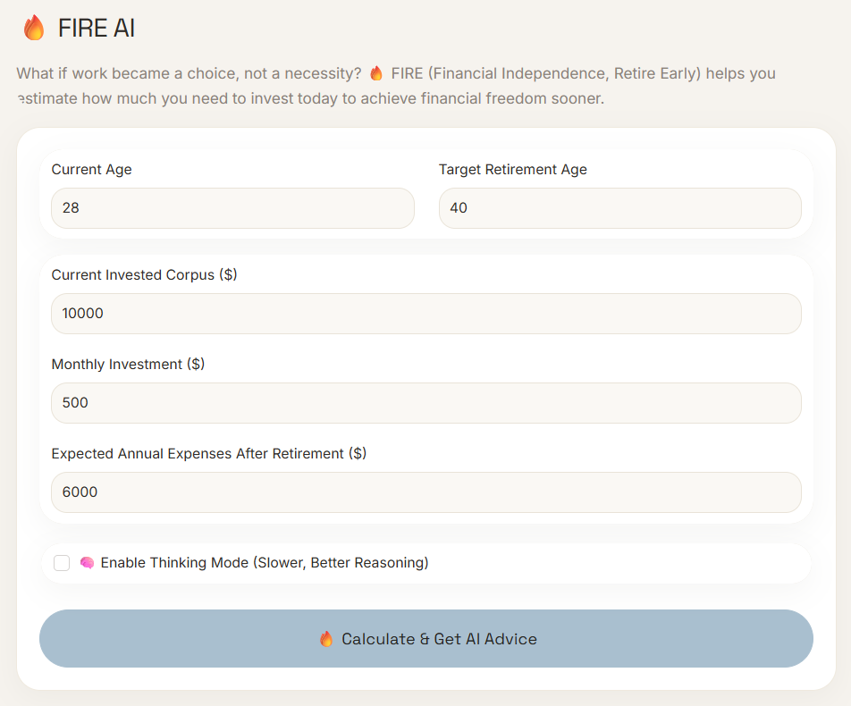
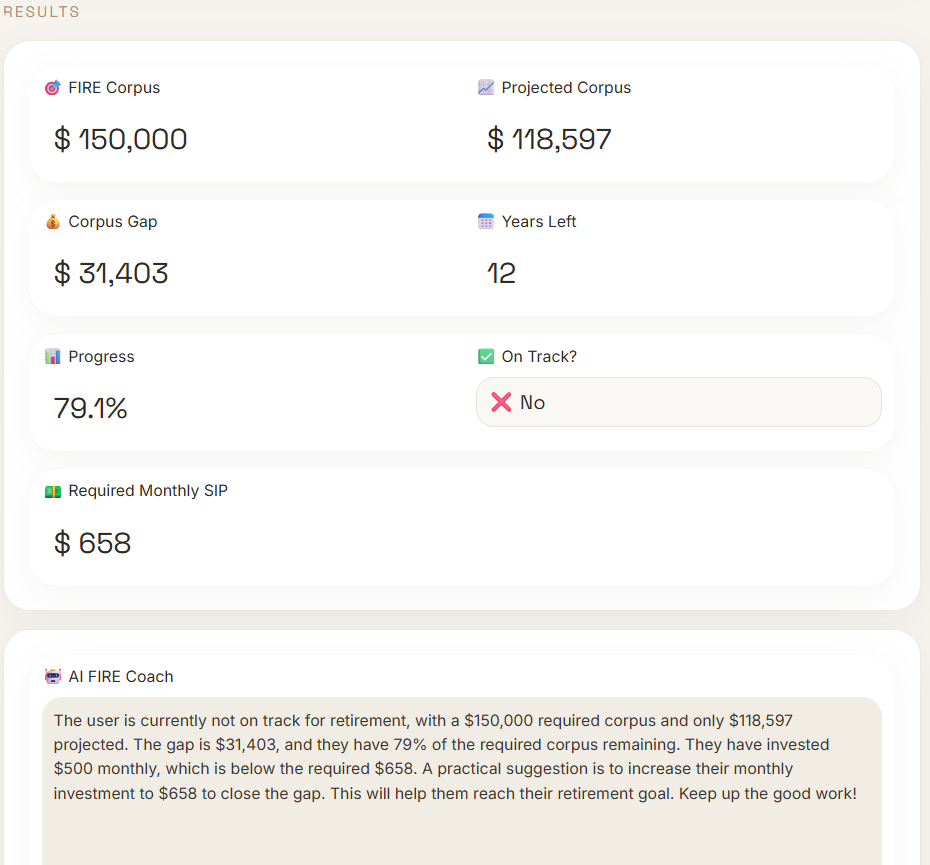

# 🔥 FIRE AI

Estimate your **FIRE (Financial Independence, Retire Early)** target and receive personalized AI-powered financial insights.

---

## Features

* 📊 Calculate your FIRE corpus
* 📈 Project your investment growth
* 💰 Identify your remaining corpus gap
* 🎯 Track your FIRE progress
* 🤖 Get personalized AI coaching with Qwen3-0.6B

---

## Tech Stack

* Python
* Gradio
* Transformers
* Qwen3-0.6B

---

## Run Locally

```bash
git clone https://github.com/HarshavardhanaNaganagoudar/FIRE_Financial-Independence-Retire-Early.git
cd FIRE_Financial-Independence-Retire-Early

pip install -r requirements.txt
python app.py
```

The app will be available at:

```
http://127.0.0.1:7860
```
---

## Disclaimer

This project is for educational purposes only and does not constitute financial advice.

---

## Try it

**[Click here](https://huggingface.co/spaces/nharshavardhana/FIRE)**

---

## 🖼️ App Screenshots

| Input | Output | 
|-------------|---------------|
|  |  |

---